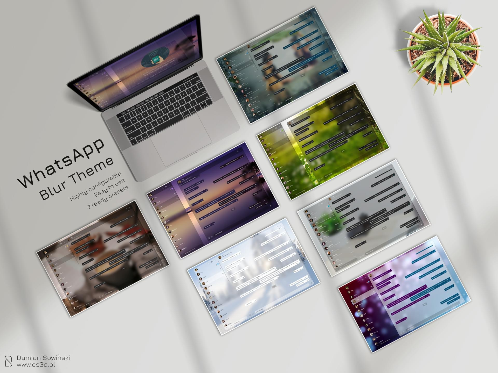

# WhatsApp Blur theme

Features
---
* Two layout version - classic, single window and split into two separate windows (contact list and chat),
* Full or reduced contact list version - for your privacy and improve a visual appearance,
* Resizable windows - adjust each window width and height to your preference,
* 15 available background images - and allow to add your own.
* New emoji windows - changed window style for emoji, quick emoji and reference person,
* Full configurable windows transparency and colours - from transparent to light blur, strong blur, light colour or complete solid colour.
* Customizable elements colour - set your favourite colour for elements like text, links, incoming message, outgoing message,  notification ico, read marker ico and more.
* 7 ready presets - to demonstrate variety configuration.

Visit [configuration page](https://github.com/DamianSowinski/whatsapp/wiki/Configuration) for more details and examples.

Installation
---
You have to install Stylus and then click on the install link below.

See also [installation page](https://github.com/DamianSowinski/whatsapp/wiki/Installation).

Getting Started
---
To learn more about using this theme and customizing it, visit the [configuration page](https://github.com/DamianSowinski/whatsapp/wiki/Configuration).

See also  [FAQ page](https://github.com/DamianSowinski/whatsapp/wiki/FAQ).

Contributions
---
If you like this project and would like to tip me for my work, then you can buy me a coffee over at [ko-fi](https://ko-fi.com/damiansowinski).

You can also use this QR Code:

Image resources
---
This theme uses free images as a background image. 

Full image list and its resources: [image list](https://github.com/DamianSowinski/whatsapp/wiki/Configuration#additional-backgrounds)

License
-------
All contents of this project are licensed under the MIT license.
